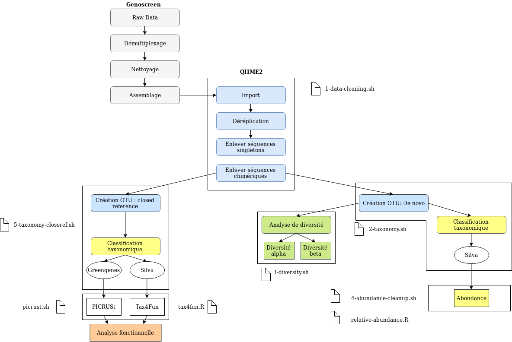

# QIIME2 Pipeline

This pipeline was conceived in order to study metagenomic data with taxonomic assignment and downstream statistical and functional analysis.
It is adapted for data that were already demultiplexed, assembled and cleaned.

## What do you need

[1] `qiime2-2018.2`

[2] `biom-format` (Python package)

[3] `PICRUSt`

[4] `RStudio`

## How to use this pipeline
We begin this pipeline with one *.fastq* file per sample as well as a manifest file and a metadata file.

- **The manifest file** (in csv):
`manifest.csv`
  - The header is: sample-id,absolute-filepath,direction

  - Each row contains the sample id, the absolute path to the sample file and the direction of the reads.

In our case, the reads are already merged so the direction of each sample will be described as forward.

Example:

```
sample-id,absolute-filepath,direction
1H,/home/sae/alaporte/Pipeline-test/Data/1H.fastq,forward
1S,/home/sae/alaporte/Pipeline-test/Data/1S.fastq,forward
```

- **The metadata file** (in tsv):
`metadata.tsv`
  - The header contains: #SampleID + all the metadata you want to include in your study. Might be the location, the pH, etc..

  - Each row contains one sample and all its corresponding metadata.

Example:

```
#SampleID	Site	Season	Year	Description
1H	Seashore	Humid	2017	sample1.seashore.humid.2017
1S	Seashore	Dry	2017	sample1.seashore.dry.2017
```

In order to use this pipeline, you need to create a general directory for your analysis containing:

- A folder called `Databases` containing various database files:
For our study, we used the SILVA132 99% full length and GREENGENES 99% ful length available at: https://docs.qiime2.org/2018.6/data-resources/

Please, create a folder `Silva` in the `Databases` folder containing the SILVA132 file trained for QIIME2 (.qza).
Please, create a folder `Greengenes` in the `Databases` folder containing the GREENGENES file trained for QIIME2 (.qza).


- A folder called `Data` : it contains your *.fastq* files as well as the *manifest* and *metadata* files.

- Then you clone this repository using your terminal with the following code:

```{bash}
git clone https://github.com/AmeLaporte/q2-pipeline.git
 ```

**The scripts (1 to x) are written in order to be launched as background task on a SGE server, don't forget to modify the environment variables with the correct values for your analysis**
QIIME2 must be installed on the server.

Open the terminal and enter the `q2-pipeline/QIIME2` folder.
Before lanching any scripts, change the access of the bash script with:

 ```{bash}
chmod a+x *sh
```

1) Launch the setup script: `0-setup.sh` by using the command: `./0-setup.sh`
It will create the folders to organize your results.

The following diagram represent the pipeline and the corresponding scripts created for each step. Feel free to use the ones that corresponds to your study.



1) Launch the `1-data-cleaning.sh` using the following command on your server where QIIME2 is installed:

For this script you need to specify the path of your manifest file. Which should be "../Data/manifest.csv"

`qsub 1-data-cleaning.sh` 

### Main analysis (de novo OTUs + diveristy and taxonomic analysis)

- The script `2-taxonomy.sh` will create the OTUs using the *de novo* method and do the taxonomic annotation using SILVA. 
You will need to specify the path to the metadata, and you can change the database by changing to the path of the database of you choice. (must be a .qza file of a database trained with QIIME2)

```{bash}
qsub 2-taxonomy.sh
```

- To do the diversity analysis: launch the `3-diversity.sh`. You will need to specify the sampling depth used for the analysis (you can choose a sampling depth by looking at the "table-nonchimeric.qzv" file from the "Visualization" folder on view.qiime2.org.), and the path to your metadata file as well as a criteria of your metadata that you want to analyze.
(Feel free to change the script to add more criteria to analyze).

```{bash}
qsub 3-diversity.sh
```

- Finally, for the taxonomic analysis, you can launch the `4-abundance-cleanup.sh` to clean and create the files to be used in RStudio in order to create the relative abundance bar plot with the `relative-abundance.R` script.
Tip: to study the lower level of phyla of your choice, you can create first a barplot with the "table-2-tax.tsv", look at the phyla that are the most abundant and change de script `4-abundance-files.sh` with the names of the taxa of your choice to create specific files to study them.

```{bash}
./4-abundance-cleanup.sh

./4-abundance-files.sh
```
After these step, you should be able to use `relative-abundance.R` to generate all the barplots.

### Functional analysis (closed-reference OTUs + functionnal analysis)

- The script `5-taxonomy-closeref.sh` will create the OTUs using the *closed-reference* method and do the taxonomic annotation using GREENGENES and SILVA. You can modify the databases by specifying the path to the files of your choice.
  
```{bash}
qsub 5-taxonomy-closeref.sh
```

- Then you will need to use `6-picrust.sh` and `6-Tax4fun.R` scripts to generate the metabolic pathway predictions for the functionnal analysis.
- The outputs of the `6-picrust.sh` can be used with the STAMP software for more in depth functional analysis.


### Tips

To create the metadata file use the Keemei plugin for google sheets. It has an option to verify if the file is optimized for QIIME2.

<https://keemei.qiime2.org/>


### References

[1] <https://qiime2.org/>

[2] <http://biom-format.org/>

[3] Aßhauer, K. P., Wemheuer, B., Daniel, R., & Meinicke, P. (2015). Tax4Fun: predicting functional profiles from metagenomic 16S rRNA data. Bioinformatics, 31(17), 2882–2884. <http://doi.org/10.1093/bioinformatics/btv287>

<http://tax4fun.gobics.de/>

[4]  R Development Core Team (2008). R: A language and environment for
  statistical computing. R Foundation for Statistical Computing,
  Vienna, Austria. ISBN 3-900051-07-0, URL <http://www.R-project.org.>